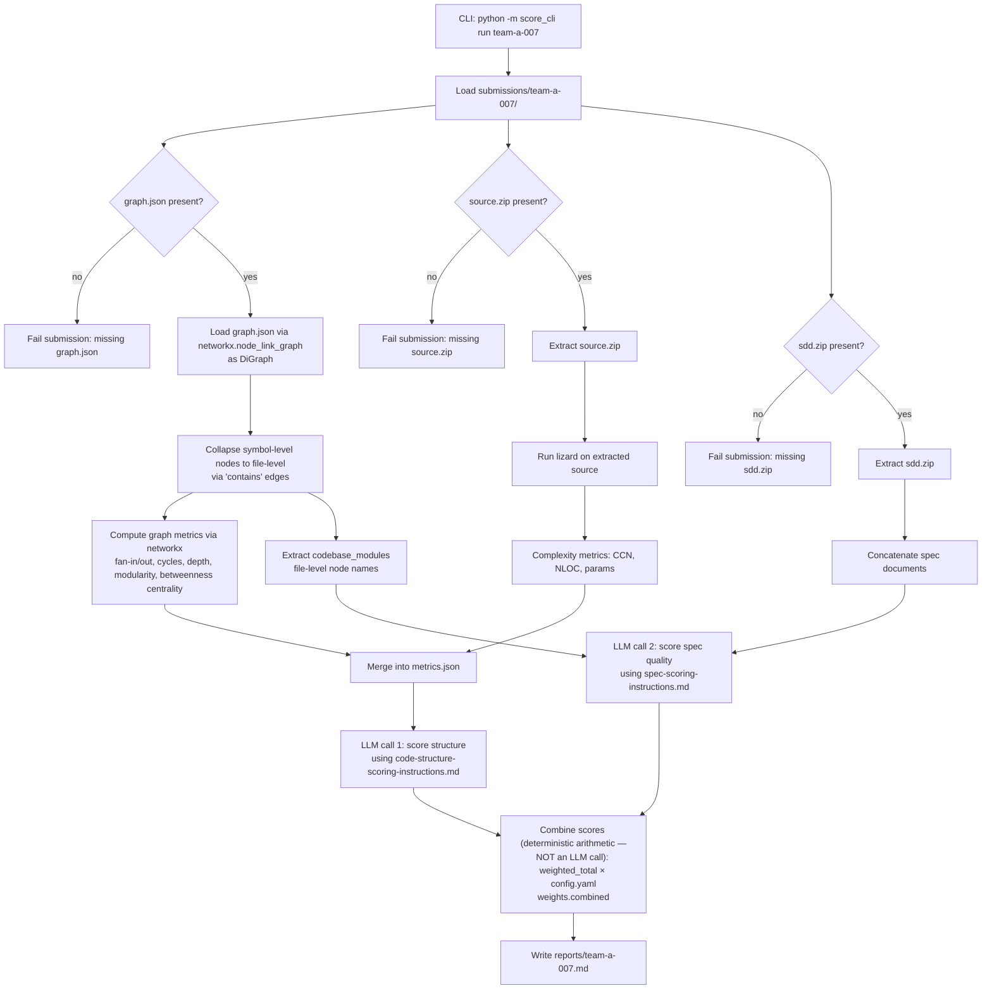

# 001 — MVP Spec: Hackathon Structure & Spec Scoring CLI

**Status:** Draft
**Owner:** TBD
**Depends on:** `code-structure-scoring-instructions.md`, `spec-scoring-instructions.md` (rubric references)

## 1. Purpose

Automate a first-pass score for hackathon submissions across two dimensions:

1. **Code structure/complexity** — derived from a dependency graph (`graph.json`, via `networkx`) and, where source is available, function-level complexity (via `lizard`).
2. **Spec-Driven Development (SDD) quality** — derived from the participant's spec documents, scored by an LLM against a rubric.

Output is a single markdown report per participant, intended as **assistive input to human judges**, not a final automated verdict.

## 2. Goals

- Given a participant folder, produce `reports/<participant-id>.md` with structure scores, spec scores, and a combined summary.
- Deterministic metrics (graph + complexity) computed locally; only the *interpretation/scoring* step calls an LLM.
- Batch-runnable across all participant folders in one command.

## 3. Non-goals (MVP)

- No correctness/functional testing of submitted code (not running the app).
- No readability/style scoring from raw source (deferred — would need a separate rubric and prompt).
- No web UI — CLI only.
- No persistent database — reports are flat markdown files on disk.

## 4. Context: submission scale

The hackathon runs for 3 hours, so submitted codebases are expected to be small (a handful of files/modules, not a sprawling monorepo). This informs the MVP:

- No need for streaming/chunked processing of `graph.json` or source — everything fits comfortably in memory.
- `lizard` and `networkx` runtimes on a submission should be sub-second; batch runs across all teams should complete quickly with no special parallelization needed for MVP.
- LLM prompts can include full spec text and full metrics JSON without truncation concerns, given the expected size.

If a submission turns out to be unusually large (e.g. a team vendored a large dependency into their repo), that's an edge case to log and inspect manually rather than something the MVP needs to handle gracefully.

## 5. Input contract

```
submissions/
  team-a-007/
    source.zip         # required — participant's source code
    sdd.zip             # required — spec documents (md/docx/pdf inside)
    graph.json           # required — dependency graph from graphify
```

- `graph.json` is Graphify's export in NetworkX node-link format: top-level `nodes` and `links` arrays (plus `directed`, `multigraph`, `graph`, `hyperedges`, `built_at_commit`). It loads directly via `networkx.node_link_graph(data)`.
  - **Mixed granularity:** `nodes` contains both file-level nodes and symbol-level nodes (functions, constants, variables) in one list. Use the explicit `"contains"` edges (file → symbol) to build the file/symbol membership map — this is more robust than matching on each node's `source_file` string, since it relies on Graphify's own structural signal rather than string equality across nodes. Module-level structural metrics (fan-in/out, cycles, dependency depth) must be computed on a **collapsed file-level graph**: remap each symbol-level `imports` / `imports_from` / `calls` edge to its parent file (looked up via the `contains` membership map) before computing metrics, or the numbers reflect symbol-graph noise rather than module coupling. `source_file` remains useful as a cross-check / fallback if a symbol has no incoming `contains` edge.
  - **`contains` edges are plumbing only** — used solely to build the file/symbol map above, not scored as their own rubric dimension. The structure rubric's dimensions (coupling, circular dependencies, dependency depth, cyclomatic complexity, function size, betweenness centrality) don't include a "logic concentration per file" metric, to keep the scoring rationale simple to explain to participants.
  - **Treat edges as directed regardless of the top-level `"directed": false` flag.** Relation types (`imports`, `imports_from`, `calls`, `contains`) are inherently directional; build the working graph as `nx.DiGraph`, not `nx.Graph`.
- `source.zip` is extracted and passed to `lizard` for complexity metrics (cyclomatic complexity, function length, parameter count).
- `sdd.zip` may contain one or more spec files in md, docx, or pdf format; all are concatenated (in filename order) for the LLM spec-review step.
- The **spec-scoring** LLM call (per `spec-scoring-instructions.md`) additionally needs `codebase_modules` — the list of file-level node names from the same collapsed graph used for structure scoring (Section 5 above). This is what its "traceability" dimension checks the spec against, so the file-level collapse step feeds both LLM calls, not just the structure one.
- Folder name (e.g. `team-a-007`) is treated as the canonical `participant_id` and used for the output filename.
- All three files are required — a submission missing any of them fails validation (see Section 9).

## 6. Output contract

```
reports/
  team-a-007.md
```

Each report contains, at minimum:
- Participant ID and timestamp
- Structure score breakdown (per rubric dimension, with justification)
- Spec quality score breakdown (per rubric dimension, with justification)
- Combined weighted total
- Red flags (if any)
- Data availability notes (e.g. "lizard metrics unavailable — no code.zip provided")

## 7. Process flow



## 8. CLI interface (MVP)

```
score-cli run <participant_id>            # score one submission
score-cli run-all                         # score every folder under submissions/
score-cli run <participant_id> --dry-run  # compute metrics.json only, skip LLM calls
```

Config (model name, API key source, rubric file paths, weight overrides) lives in a single `config.yaml` at project root.

## 9. Error handling

| Condition | Behavior |
|---|---|
| `graph.json` missing or invalid JSON | Abort that submission, log error, continue batch |
| `sdd.zip` missing or empty after extraction | Abort that submission, log error, continue batch |
| `source.zip` missing | Abort that submission, log error, continue batch |
| `source.zip` present but `lizard` finds 0 functions | Proceed, note "no analyzable source found" in report |
| LLM call fails / times out | Retry once, then write report with `"llm_error"` field and no scores for that section |
| `reports/` directory doesn't exist | Create it |

## 10. Acceptance criteria

- [ ] Running `score-cli run team-a-007` on a folder with all three required files produces a complete report with both structure and spec scores.
- [ ] Running it on a folder missing any of `source.zip`, `graph.json`, or `sdd.zip` fails gracefully with a clear error, without crashing a batch run.
- [ ] `run-all` processes every folder under `submissions/` and continues past individual failures.
- [ ] Output is well-formed markdown, one file per participant, under `reports/`.
- [ ] All deterministic metrics (graph + complexity) are computed with zero LLM calls, and are inspectable independently via `--dry-run`.

## 11. Future (post-MVP, not in scope now)

- Readability/style scoring from raw source.
- Multiple LLM scoring passes averaged for consistency.
- Web dashboard for judges instead of flat markdown files.
- Automatic detection of spec-before-code via commit history (if repos, not zips, become available).
