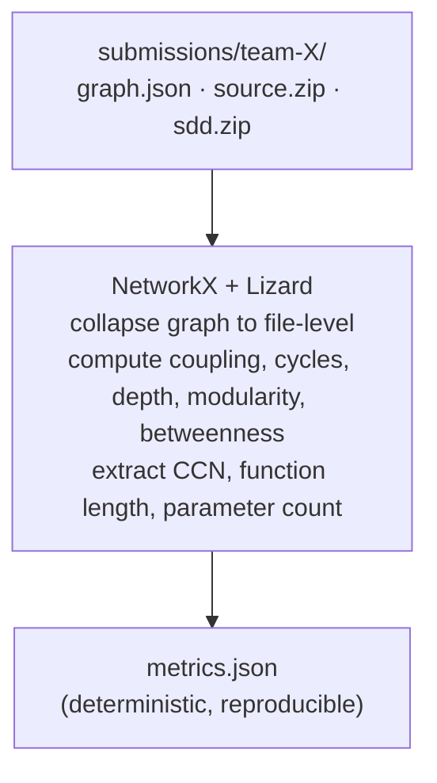
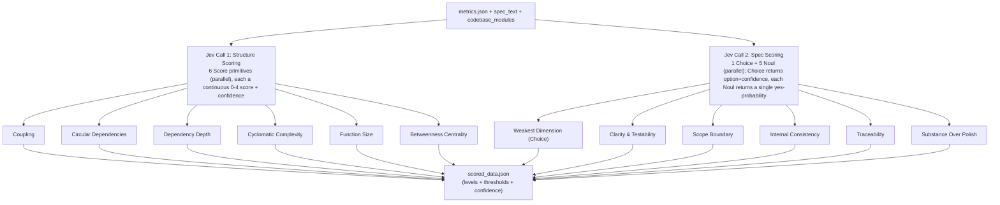
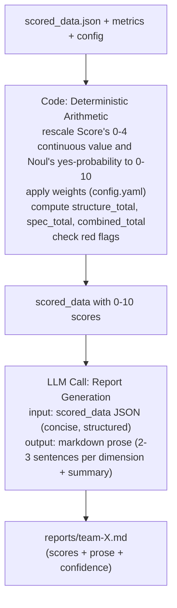

# scorer_cli Architecture

## Overview

**scorer_cli** is an automated hackathon submission scoring system. It scores code structure (via graph analysis + complexity metrics) and Spec-Driven Development quality using TypeSafe's **Jev** (System One), then generates readable markdown reports.

**Pipeline:**
1. **Metrics Collection** (local, deterministic) — Extract structural and complexity metrics
2. **Jev Scoring** (structured judgment) — 2 Jev API calls → levels + thresholds + confidence
3. **Report Generation** (deterministic + LLM prose) — Code computes scores, Claude writes markdown

## Three-Phase Pipeline

### Phase 1: Metrics Collection (Local)



**Cost:** Zero API calls. All local.

**Output:** `metrics.json` with graph metrics + complexity metrics.

### Phase 2: Jev Scoring (Structured Judgment)



**Cost:** ~4 min-tokens total. Calibrated by TypeSafe.

**Key trait:** Jev returns a confidence measure on every answer → judges know which scores are
ambiguous. Score answers are continuous (a probability-weighted average across levels, not a
discrete pick); Noul answers are a single yes-probability, from which code derives an answer
and confidence (see `docs/design/spec-scoring.md`).

### Phase 3: Report Generation (Deterministic + LLM Prose)



**Cost:** ~2–3 min-tokens. LLM only writes prose, doesn't judge.

**Key trait:** LLM sees structured data, writes focused explanations. Scoring logic is in code.

## Design Philosophy

### Separation of Concerns

- **Jev:** Answers "Is this good?" with typed confidence. Judgment layer.
- **Code:** Applies rubric rules (weights, thresholds, red flags). Policy layer.
- **LLM:** Explains the scores in English. Prose layer.

This keeps each component focused and testable.

### Determinism

- Metrics are deterministic (same input → same metrics.json)
- Jev scores are calibrated (same input → consistent levels)
- Code arithmetic is deterministic (same scores + weights → same totals)
- Only prose is generated (LLM). Scores are structured.

### Composability

Weights, thresholds, and rubric descriptions live in `config.yaml`. Change them without re-running Jev or LLM:

```bash
# Edit config.yaml weights, then:
$ uv run score-cli recompute reports/metrics/*.json
# Regenerates all reports in seconds (no API calls)
```

## Directory Structure

```
scorer_cli/                    # project directory
├── README.md                  # Main entry point
├── CLAUDE.md                  # Claude Code project instructions
├── config.yaml.example        # Configuration template
│
├── docs/                      # All documentation
│   ├── INDEX.md                # Navigation guide
│   ├── HOW_IT_WORKS.md         # Simplified pipeline diagram (for participants)
│   ├── ARCHITECTURE.md         # This file
│   ├── QUICKSTART.md           # Get started (5 min)
│   ├── HANDOFF.md              # Project handoff summary
│   ├── DEVELOPER_CHECKLIST.md  # Implementation guide
│   │
│   ├── design/                 # Implementation design (for devs)
│   │   ├── structure-scoring.md   # 6 Score primitives (detail)
│   │   ├── spec-scoring.md        # 1 Choice + 5 Noul (detail)
│   │   └── report-generation.md   # LLM prompt + fallback logic
│   │
│   ├── spec/
│   │   └── rubrics.md          # Unified rubric reference
│   │
│   └── examples/
│       └── sample-report.md    # Example output (for judges)
│
└── app/                        # Application code
    ├── __main__.py             # CLI entry point
    ├── scorer.py               # Main orchestration
    ├── metrics.py              # Metrics collection
    ├── jev_scorer.py           # Jev API calls (judgment)
    ├── scoring_engine.py       # 0–10 score mapping + arithmetic
    ├── llm_reporter.py         # Claude API calls (prose)
    └── report_generator.py     # Markdown formatting + file I/O
```

Note: `pyproject.toml` and a formula reference (`design/scoring-math.md`) are not yet written — see `HANDOFF.md` for what's outstanding.

## Key Data Structures

### metrics.json (after Phase 1)

```json
{
  "submission_id": "team-42",
  "graph_metrics": {
    "node_count": 87,
    "avg_fan_in": 1.6,
    "max_fan_in": 12,
    "avg_fan_out": 1.6,
    "max_fan_out": 9,
    "longest_dependency_path": 7,
    "circular_dependencies": [["moduleA", "moduleB", "moduleA"]],
    "modularity_score": 0.41,
    "avg_betweenness_centrality": 0.04,
    "max_betweenness_centrality": 0.38,
    "top_betweenness_nodes": [...]
  },
  "complexity_metrics": {
    "total_functions": 154,
    "avg_cyclomatic_complexity": 4.2,
    "max_cyclomatic_complexity": 23,
    "functions_above_complexity_threshold": [...],
    "avg_function_length_nloc": 18.3,
    "avg_parameter_count": 2.1
  }
}
```

### scored_data.json (after Phase 2 + Phase 3 arithmetic)

```json
{
  "submission_id": "team-42",
  "structure": {
    "scores": {
      "coupling": {
        "score_0_10": 7.5,
        "level": 3,
        "level_label": "Good",
        "confidence": 0.78
      },
      // ... (all 6 dimensions; "level"/"level_label" are derived by rounding
      // Jev's continuous 0-4 score, not returned directly by the API)
    },
    "weighted_total": 7.8
  },
  "spec": {
    "scores": {
      "clarity": {
        "score": 8.0,
        "answer": "yes",
        "confidence": 0.72
      },
      // ... (all 5 dimensions; "answer"/"confidence" are derived from Jev's
      // single Noul probability, see docs/design/spec-scoring.md)
    },
    "weighted_total": 7.6,
    "weakest_dimension": {
      "answer": "Traceability",
      "confidence": 0.52
    }
  },
  "combined_score": 7.7,
  "red_flags": ["Function processOrder has CCN 23", ...]
}
```

### reports/team-X.md (final output)

Generated from scored_data + LLM prose. Example in `examples/sample-report.md`.

## Configuration (config.yaml)

```yaml
typesafe:
  api_key_env: "TYPESAFE_API_KEY"
  api_endpoint: "https://api.typesafe.ai"  # typesafe-sdk's default; only needed if self-hosting
  model: "jev-latest"  # NOT "jev" - the real SDK rejects that as an unknown model

report_generation:
  api_key_env: "ANTHROPIC_API_KEY"
  model: "claude-opus-5"  # or claude-haiku for cost
  temperature: 0.3
  max_tokens: 2000

weights:
  structure: 0.5
  spec: 0.5

structure_rubric:
  coupling:
    level_1: "Critical — pervasive high coupling"
    # ... (5 levels per dimension)

spec_rubric:
  clarity_testability:
    threshold: 0.65  # Confidence threshold for "yes"
    yes_score_range: [7.5, 9.0]
    no_score_range: [1.0, 4.0]
  # ... (5 dimensions)

red_flags:
  circular_deps_involving_more_than: 3
  max_ccn_threshold: 20
  fan_coupling_multiple: 5.0
  betweenness_multiple: 10.0
  min_modules_mentioned: 2
```

## CLI Interface

```bash
# Score one submission
uv run score-cli run team-a-007

# Score all submissions
uv run score-cli run-all

# Compute metrics only (no Jev/LLM calls)
uv run score-cli run team-a-007 --dry-run

# Recompute reports from existing metrics.json (no API calls)
uv run score-cli recompute reports/metrics/*.json
```

## Cost & Performance

| Metric | Value |
|--------|-------|
| **Tokens per submission** | ~4–5 min-tokens |
| **API calls per submission** | 3 (2 Jev + 1 LLM) |
| **Latency per submission** | ~4s (Jev <1s each, LLM <2s) |
| **Cost per 50 teams** | ~$2 (was $4 with 2 LLM calls) |
| **Savings** | 50–60% tokens, 5–15× faster |

## Confidence Levels

Every Jev answer includes confidence (0–1). Judges use this to prioritize manual review:

- **> 0.85:** Clear, straightforward case
- **0.70–0.85:** Strong signal, minor ambiguity
- **0.50–0.70:** Weak signal, worth manual check
- **< 0.50:** Very ambiguous, must review manually

Low confidence on critical dimensions (e.g., cyclomatic complexity) → flag for human inspection.

## Error Handling

| Error | Behavior |
|-------|----------|
| Jev timeout | Retry once, then null scores + error note in report |
| LLM timeout | Retry once, then fallback to auto-generated markdown (scores only) |
| Missing submission files | Abort that submission, log error, continue batch |
| Metrics null fields | Skip corresponding Jev question, note in report |

## Future Enhancements

1. **Multi-run averaging:** Average 2–3 Jev calls for higher confidence
2. **Dashboard:** Real-time scoring progress + confidence heatmap
3. **Judge feedback loop:** "Jev said X, I disagree with Y" → calibration signal
4. **CSV export:** All scores + confidence for analysis/trending
5. **Async batch:** Process multiple submissions in parallel

## For Developers

**Getting started:**
1. Read `QUICKSTART.md` (5 min)
2. Read design docs in `design/` (understand Jev + LLM calls)
3. Follow `DEVELOPER_CHECKLIST.md` to code
4. Run on sample fixture: `uv run score-cli run fixtures/team-sample-001`

**Key modules:**
- `metrics.py` — NetworkX + Lizard (no changes needed)
- `jev_scorer.py` — Jev questions & API calls
- `scoring_engine.py` — 0–10 score mapping + weights
- `llm_reporter.py` — Claude prose generation
- `report_generator.py` — Markdown formatting

See `design/` folder for implementation details.
