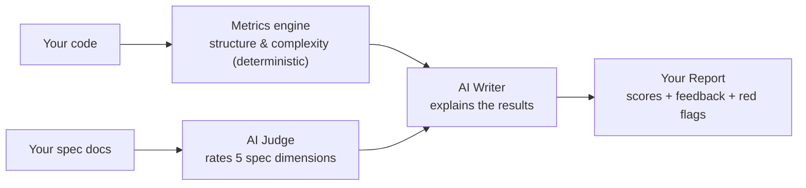

# How scorer_cli Works

A plain-language overview for hackathon participants.

1. **We look at your code and your spec.** No manual grading — the same checks run for every team.
2. **Code structure is scored with plain math, not AI.** Your dependency graph and complexity
   metrics get compared against fixed, published thresholds (see `spec/rubrics.md`) — the same
   input always gives the same score.
3. **Spec quality is judged by an AI** (Jev), because that genuinely requires reading prose:
   are requirements testable? Does the spec contradict itself? Does it map to your actual files?
   It rates 5 dimensions and says how confident it is in each.
4. **A second AI writes plain-English feedback** summarizing the results.
5. **You get a report** (`reports/<your-team>.md`) with scores out of 10, a short summary, and
   any red flags worth fixing.

Low-confidence spec scores just mean "ambiguous signal, a human should double-check" — they
aren't automatically bad. Structure scores don't have a confidence value since they're computed,
not judged.

See [spec/rubrics.md](spec/rubrics.md) for exactly what each dimension measures, or [examples/sample-report.md](examples/sample-report.md) for a full sample report.
