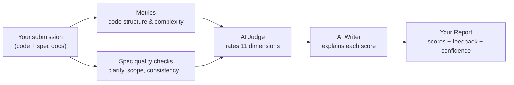

# How scorer_cli Works

A plain-language overview for hackathon participants.

1. **We look at your code and your spec.** No manual grading — the same checks run for every team.
2. **An AI judge rates 11 dimensions** (6 about code structure, 5 about how well your spec was written) and says how confident it is in each rating.
3. **A second AI writes plain-English feedback** explaining why you got each score.
4. **You get a report** (`reports/<your-team>.md`) with scores out of 10, a short justification per dimension, and any red flags worth fixing.

Low-confidence scores just mean "ambiguous signal, a human should double-check" — they aren't automatically bad.

See [spec/rubrics.md](spec/rubrics.md) for exactly what each dimension measures, or [examples/sample-report.md](examples/sample-report.md) for a full sample report.
