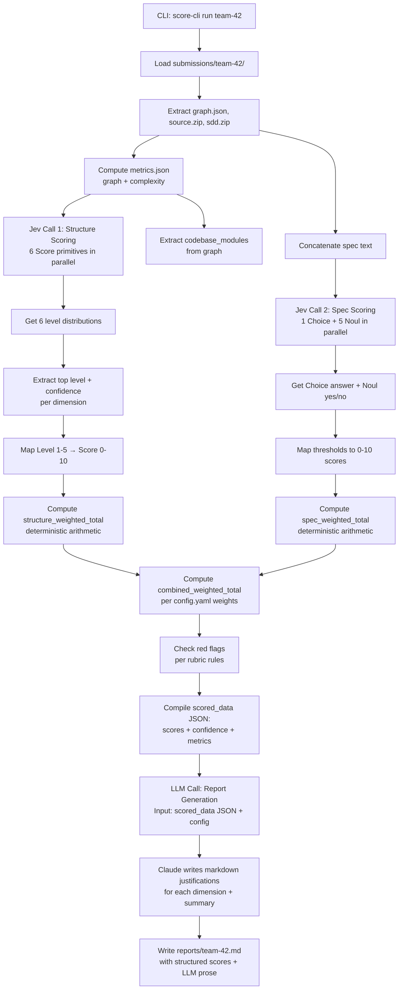

# 002 — Jev Redesign: Structured Scoring via TypeSafe

**Status:** Design  
**Owner:** TBD  
**Replaces:** `001-mvp.md` (LLM free-form scoring)  
**Depends on:** `../code-structure-jev-questions.md`, `../spec-jev-questions.md` (Jev question definitions)

## 1. Purpose

Replace free-form LLM scoring with **structured Jev judgments** + **final LLM summarization**. Instead of two expensive text-generation calls that produce paragraph-length justifications parsed into numbers, use:

1. **Jev Structure Scoring:** 6 independent **Score** primitives (one per rubric dimension), each rated 1–5.
2. **Jev Spec Scoring:** 1 **Choice** primitive (weakest dimension) + 5 **Noul** primitives (threshold checks per dimension).
3. **LLM Report Generation:** Single cheap API call to write readable markdown from structured scores + metrics.

Output is identical in format to the original (`reports/<team>.md`), but the scoring is **deterministic, typed, and composable** — and the prose is human-written, not parsed from metrics.

## 2. Key Improvements Over Original

| Aspect | LLM Approach (2 calls) | Jev + LLM Approach (2 Jev + 1 LLM) |
|--------|----------------------|-----------------------------------|
| **Scoring calls** | 2 text-gen LLM calls (expensive, mixed scoring + prose) | 2 Jev API calls (structured, cheap) + 1 LLM call (prose only) |
| **Output format** | Free-form paragraphs, regex-parsed into numbers | Typed answers: Score levels (1–5) + final prose from structured data |
| **Determinism** | Non-deterministic; same input may produce different prose | Deterministic scoring; Jev judgments are calibrated for consistency |
| **Composability** | Scores isolated; cannot adjust weights without re-running both LLM calls | Code owns weighting; change `config.yaml` and recompute without re-running Jev/LLM |
| **Latency** | High (two full LLM generations, 10–30s each) | Medium (Jev <1s each, LLM summarization <2s) |
| **Interpretability** | Prose is readable but scoring logic is hidden in LLM reasoning | Structured: "Coupling Level 3, Complexity Level 4" + clean prose explaining why |
| **Token cost** | ~10 min-tokens per submission | ~4–5 min-tokens per submission (50–60% savings) |
| **Quality** | LLM tries to do two jobs: judge and write | Jev judges (focused), LLM writes (focused) → better separation of concerns |

## 3. Jev Primitives: Structure Scoring

**Input State:**
```json
{
  "submission_id": "team-42",
  "graph_metrics": { ... },
  "complexity_metrics": { ... }
}
```

**Six independent Score primitives (run in parallel):**

| Dimension | Levels | Question |
|-----------|--------|----------|
| **Coupling** | 1–5 | How severe is the coupling in this codebase? (1=Critical, 5=Excellent) |
| **Circular Dependencies** | 1–5 | How problematic are circular dependencies? |
| **Dependency Depth** | 1–5 | Is the dependency chain depth appropriate for this project size? |
| **Cyclomatic Complexity** | 1–5 | How manageable is the cyclomatic complexity? |
| **Function Size** | 1–5 | How disciplined is function sizing and parameterization? |
| **Betweenness Centrality** | 1–5 | Are there architectural bottlenecks (high betweenness nodes)? |

Each **Score** returns a probability distribution over the 5 levels. Code extracts the top level and its confidence, then maps 1–5 → 0–10 score for reporting (e.g., Level 4 → score 7.5).

See `../code-structure-jev-questions.md` for full question text, state references, and scoring guidance.

## 4. Jev Primitives: Spec Scoring

**Input State:**
```json
{
  "submission_id": "team-42",
  "spec_text": "concatenated spec, with filename headers",
  "codebase_modules": ["server.js", "libs/mailer.js", ...]
}
```

**One Choice primitive (identify weakest dimension):**
```
Which SDD dimension is the weakest in this spec?
Options: {Clarity, Scope, Consistency, Traceability, Polish}
```

Returns the most likely weak dimension + probabilities. Helps judges prioritize what to read manually.

**Five independent Noul primitives (threshold checks):**

| Dimension | Question |
|-----------|----------|
| **Clarity & Testability** | Are requirements concrete and testable throughout? |
| **Scope Boundary** | Is in-scope / out-of-scope explicitly or clearly inferable? |
| **Internal Consistency** | Does the spec contradict itself? |
| **Traceability** | Do spec-named components plausibly map to codebase_modules? |
| **Substance Over Polish** | Is the spec substantive, not just well-formatted padding? |

Each **Noul** returns `{yes, no}` with probability. Code maps yes → score 8, no → score 3, interpolating confidence as needed.

See `../spec-jev-questions.md` for full question text, state, criteria, and guidance.

## 5. Process Flow



## 6. Scoring Math

**Structure Weighted Total:**
```
structure_score = 
  (coupling_score × 0.21) +
  (circular_deps_score × 0.17) +
  (dependency_depth_score × 0.13) +
  (complexity_score × 0.21) +
  (function_size_score × 0.13) +
  (betweenness_score × 0.15)
```

**Spec Weighted Total:**
```
spec_score = 
  (clarity_score × 0.25) +
  (scope_score × 0.15) +
  (consistency_score × 0.15) +
  (traceability_score × 0.25) +
  (polish_score × 0.20)
```

**Combined:**
```
combined_score = 
  (structure_score × config.weights.structure) +
  (spec_score × config.weights.spec)
```

All arithmetic is done in **code**, not by Jev. Jev only provides the raw judgments (Score levels and Noul thresholds).

## 7. Red Flags

Same rules as original, but sourced from Jev scores + metrics:

- **Circular dependency touching > 3 modules:** Check `circular_dependencies` in metrics.json
- **Single function CCN > 20:** Check `max_cyclomatic_complexity` in metrics.json
- **Node fan-in/out > 5× average:** Check `max_fan_in`, `max_fan_out` vs. `avg_fan_in`, `avg_fan_out`
- **Betweenness centrality > 10× average:** Check `max_betweenness_centrality` vs. `avg_betweenness_centrality`
- **Spec weakness flagged by Choice:** If `weakest_dimension` output from Jev has low confidence, flag it
- **Fewer than 2 codebase_modules in spec:** Check spec_text word count for mentioned modules

## 8. Output Contract

Unchanged from original. Reports still live in `reports/<team>.md` with the same structure:
- Participant ID and timestamp
- Structure score breakdown (6 dimensions, with justification)
- Spec quality score breakdown (5 dimensions, with justification)
- Combined weighted total
- Red flags
- Data availability notes
- Scoring metadata (Jev/LLM versions, call details)

The justifications are now **LLM-generated prose based on structured Jev scores**, not free-form LLM reasoning. Example format:

```
### Coupling — Weight 21%

| | |
|--|--|
| **Score** | 7.5 / 10 |
| **Jev Level** | 4 (Good) |
| **Confidence** | 78% |
| **Justification** | Jev rated coupling as Level 4 with 78% confidence. Graph shows avg fan-in 1.6, max fan-in 7 (~4.4× average). One plausible hotspot (mailer.js), but no god-modules. Solid isolation for a hackathon codebase. |
```

The prose is **human-readable** (written by Claude) while still **grounded in structured data** (from Jev + metrics).

## 9. Configuration

`config.yaml` now includes:

```yaml
# Jev (structured scoring)
typesafe:
  api_key_env: "TYPESAFE_API_KEY"
  api_endpoint: "https://api.typesafe.ai/v1"
  model: "jev"  # TypeSafe's System One model

# LLM (report generation — writes prose from scores)
report_generation:
  model: "claude-opus-5"  # Or Claude Haiku for cost savings
  api_key_env: "ANTHROPIC_API_KEY"
  temperature: 0.3  # Low randomness for consistency
  max_tokens: 2000

weights:
  structure: 0.5
  spec: 0.5

structure_rubric:
  coupling:
    level_1: "Critical — pervasive high coupling"
    level_2: "Poor — several god-modules"
    level_3: "Fair — one or two hotspots"
    level_4: "Good — moderate, isolated hotspots"
    level_5: "Excellent — low, even coupling"
  # ... (all 6 dimensions)

spec_rubric:
  # Thresholds for Noul yes/no mapping to scores
  clarity_threshold: 0.65  # Noul confidence above this → yes → score 8
  scope_threshold: 0.60
  # ... (all 5 dimensions)
```

## 10. Error Handling

| Condition | Behavior |
|-----------|----------|
| Jev API timeout / failure | Retry once, then write report with `"jev_error"` field and null scores for that section |
| LLM (report generation) timeout / failure | Retry once, then fall back to auto-generated markdown (score table without prose) |
| Submission missing any file | Abort, log error, continue batch (unchanged) |
| Jev returns unexpected output shape | Fail gracefully with clear error about API contract mismatch |
| LLM returns non-markdown | Log warning, include as-is (error in one dimension doesn't block report) |
| Metrics.json has null fields | Proceed; set corresponding Jev question to skip if metric is unavailable |

## 11. Migration Path from Original

1. Run original LLM scorer on existing fixtures to generate baseline reports.
2. Run new Jev + LLM scorer on same fixtures; compare outputs.
   - Jev scores should correlate strongly with original (same rubric applied)
   - Prose will differ (Jev + LLM separates judgment from explanation)
3. Deploy alongside original (A/B by config flag) for validation.
4. Collect judge feedback on clarity and usefulness of structured scores + confidence levels.
5. Once validated, sunset original scorer and remove pure-LLM scoring.

## 12. Cost Breakdown

**Original (2 LLM calls):**
- ~5 min-tokens per structure explanation
- ~5 min-tokens per spec explanation
- **Total: ~10 min-tokens per submission**

**New (2 Jev + 1 LLM):**
- ~1 min-token per Jev structure call
- ~1 min-token per Jev spec call
- ~2–3 min-tokens for LLM report generation (structured input, prose output)
- **Total: ~4–5 min-tokens per submission**

**Expected savings: 50–60% token reduction** (Jev is cheaper than full LLM inference; LLM summarization is cheaper than two full LLM scoring passes).

## 13. Future Enhancements

- Average multiple Jev calls per submission for consistency.
- Collect Jev confidence scores as signals for which submissions need manual review.
- Use confidence to prioritize judge effort: sort by low-confidence scores first.
- Build judge dashboard to show Jev scores + confidence + metrics side-by-side for collaborative review.
- Export scored_data.json alongside reports for programmatic analysis and trending.
